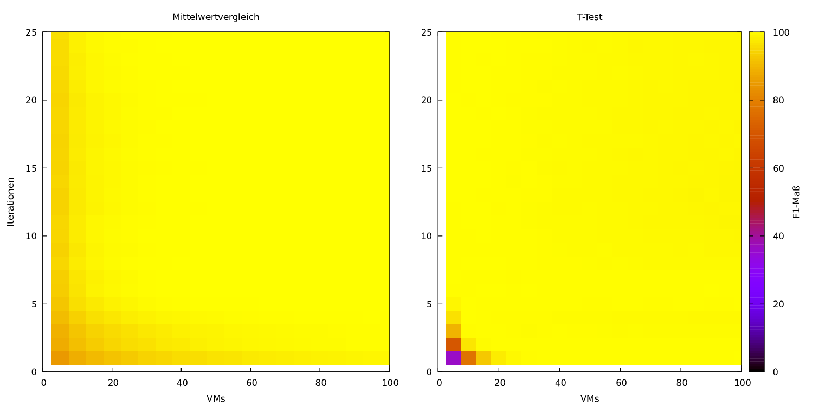

Precision Experiment
===================

The aim of this project is to determine a measurement method which is capable of distuingishing the performance of artificial unit tests. In general, performance tests for Java need multiple vm starts and in this multiple vm starts warmup executions, measurement executions and, if the testcase is small, which we consider as given, testcase repetitions. With this project, you can pick an arbitraty precission level and use experiments in order to determine how many executions are needed to reach this precision level. 

The artificial unit tests focus on addition and ram reservation. Unit tests for other purposes could be added. Experiments show that I/O behaves much different from the aforementioned workloads.

# Reusing Existing Measurements

If you got existing measurement results from a Peass run, you can use these to check when your performance change would have been reproduced. Therefore, build `precision-analysis` by executing `../gradlew fatJar` in this folder and execute `java -cp build/libs/precision-analysis-all-2.13.jar de.precision.analysis.repetitions.GeneratePeassPrecisionPlot -data $DATAFOLDER -slowVersionName $SLOWVERSION`. 

The data folder needs to be the `measurementsFull` folder of a peass execution. Afterwards, you will find precision data in each testcase folder, e.g. `$DATAFOLDER/measurements/$TESTCASE/results`. To plot these data, execute `cd scripts` and run `./createPeassHeatmap.sh $DATAFOLDER/measurements/$TESTCASE/results` for the `$TESTCASE` you want to visualize. Afterwards, you'll find heatmaps of your measurement in `peass_$TESTCASE`.

The result for the mean value comparison and T-Test might look like this: (converted with `convert -density 150 result_meanTTest.pdf -quality 90 result_meanTTest.png`)

# Test Execution

## Before all tests

These tests should be executed in an environment with as less parallel processes as possible, therefore we recommend to use a separate maschine for measurements. Furthermore, the CPU should not change its scaling. This can be achieved by running ./PrepareMeasurements on an ubuntu system.

It is assumed that tar and xz for optimal compression of results are installed on the measurement maschine.

Optionally, you can control parameters of the tests by:
* changing src/test/java/de/confidence/Constants.java: Count of executions (At least 5000 is recommended, else you will only measure warmup)
* the environment variable VMS or changing the shell-skript that you are executing

## Examining Different Repetition Counts

This allows to research which configuration is suitable for determining a performance change, especially which count of repetitions is suitable. 

To start this experiment, go to `scripts`, uncomment the repetition counts you want to reserach in `runRepetitionEvolutionPercent.sh` and run `./runRepetitionEvolutionPercent.sh $testName $diffsize`.

Tests may be every test in `src/test/java`, especially
* `de.precision.AddTest_NoGC` (default)
* `de.precision.RAMTest_NoGC`
* `de.precision.SysoutTest_NoGC`
The `$diffsize` defines the count of operations (i.e. Add, RAM-reservation or System.out.println-operations) that the slower and faster version of the test differ by. 

You might specify
* the count of VM starts by the parameter `$VMs`,
* the base workload size of the experiment (by default 300) by `$BASESIZE`,
* to start parallel experiments by setting `$PARALLEL` to 1 and
* to not redirect System.out to null by setting `$REDIRECT` to 1.

Afterwards, results are in `~/.KoPeMe/repetitionEvolution_"$BASESIZE"_"$REDIRECT"_"$diffsize"_"$testName"_"$id"` (with the id starting with 1 and incrementing if an experiment folder exists). `precision-analysis/scripts/createRepetitionHeatmap.sh` might help you for creating the heatmaps and choosing an appropriate configuration.

## Examining Different Sizes

This allows to research how the coefficient of variation changes with growing workload size.

To start this experiment, go to `scripts` and run `./runSizeEvolution.sh $testName`. The `$testName` and `$REDIRECT` may be specified as described above.

Afterwards, results are in `~/.KoPeMe/sizeEvolution_"$REDIRECT"_"$testName"_"$id"`.

